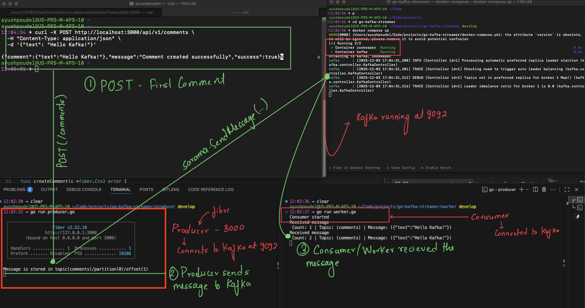

# Go Kafka Streamer

A simple project to demonstrate how a Kafka producer and consumer work using Go.

Kafka is started using Docker Compose. After the services are running, the Go producer application and the Go consumer application are executed separately.

The producer is built with the Fiber framework and exposes a /api/v1/comments POST API endpoint. A JSON payload containing a text field is sent using curl. The producer converts the payload to bytes and publishes the message to the Kafka topic named comments.

The consumer subscribes to the same comments topic and continuously listens for new messages. Whenever the producer publishes a message, the consumer receives it and prints the output in real time.

This shows the full flow of sending a comment through an HTTP request, publishing it to Kafka, and consuming it immediately in a separate service.
